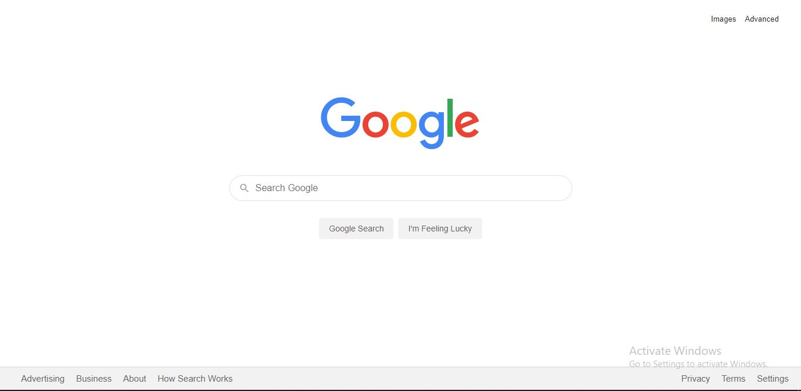
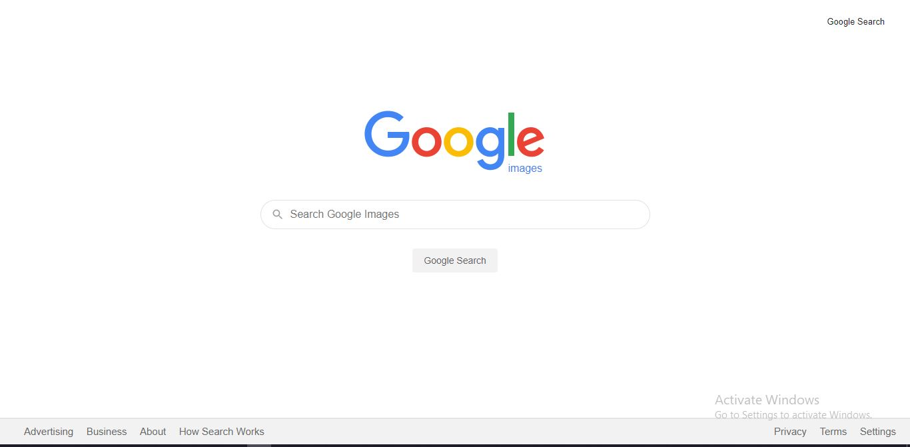
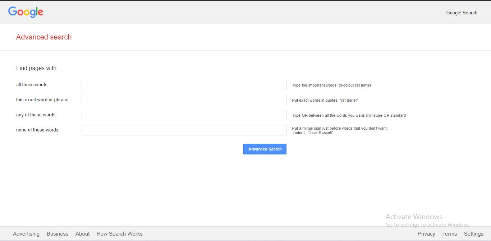

# CS50-Project-0(Seacrh)
Project-0 for CS50's Web Programming with Python and JavaScript.

All the required things for this project are listed [here](https://cs50.harvard.edu/web/2020/projects/0/search/)

Screenshots of the three pages of this project:  

  1. Google HomePage: 
  
  2. Google Image Seacrh: 
  
  3. Google Advance Search: 
    

